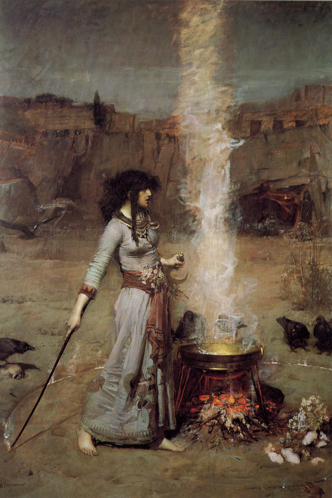
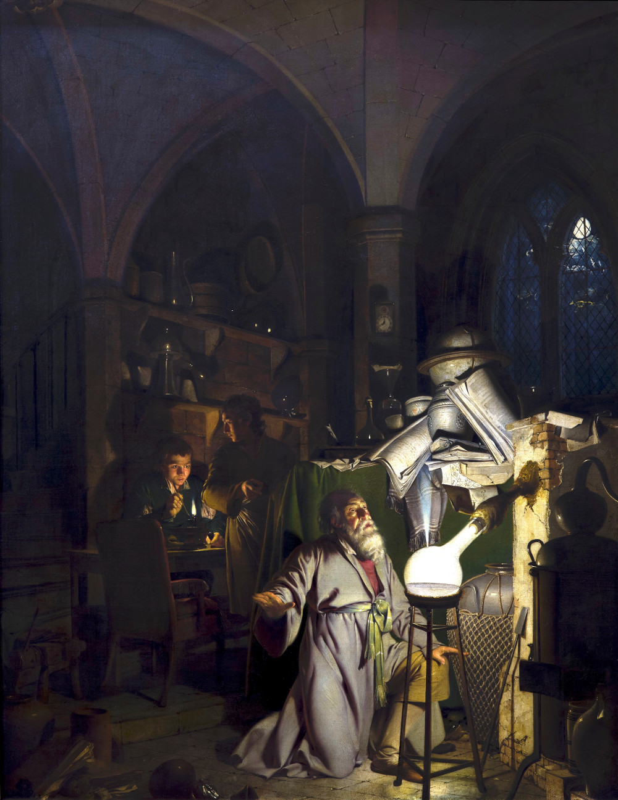
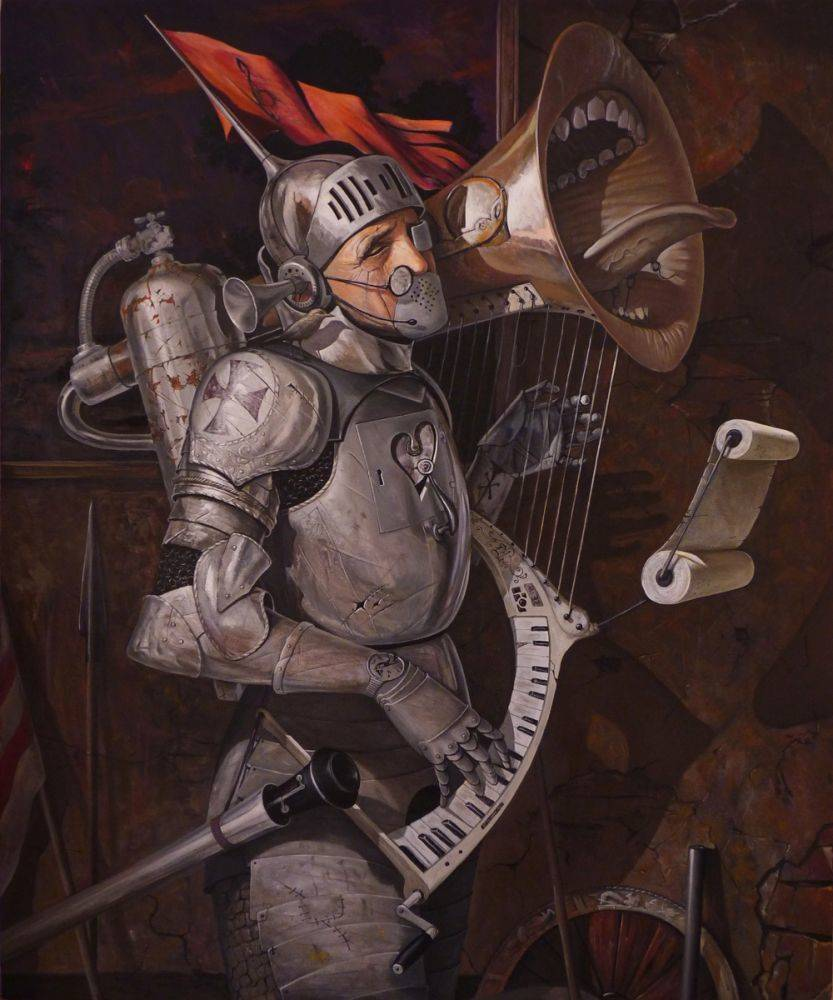

visual
######

John William Waterhouse, *The Magic Circle*

Joseph Wright of Derby, *The Alchemist*

Adrian Borda, *Requiem for Peace*

Hieronymus Bosch, *The Garden of Earthly Delights*
- https://en.wikipedia.org/wiki/The_Garden_of_Earthly_Delights

The Public Domain Review
- Space Colony Art from the 1970s https://publicdomainreview.org/collections/space-colony-art-from-the-1970s/

The Cleveland Museum of Art: 30,000 Works into the Public Domain
http://www.openculture.com/2019/01/the-cleveland-museum-of-art-digitizes-its-collection.ht…

Download 422 Free Art Books from The Metropolitan Museum of Art | Open Culture
http://www.openculture.com/2015/03/download-422-free-art-books-from-the-metropolitan-museu…

music?
------

other
-----

.. image:: ./visual/bug.jpg
